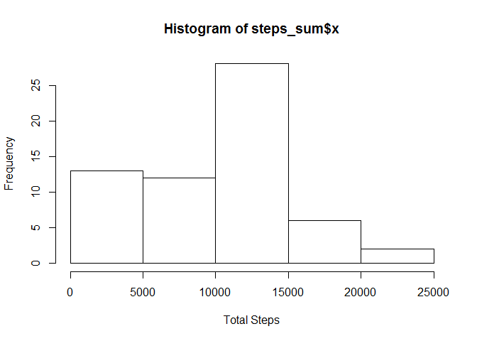
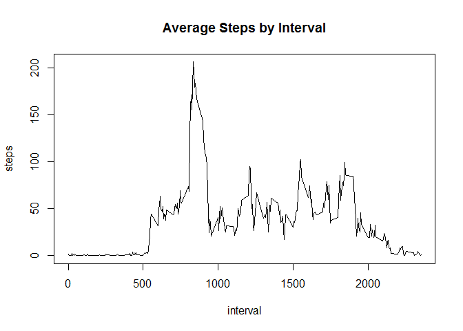
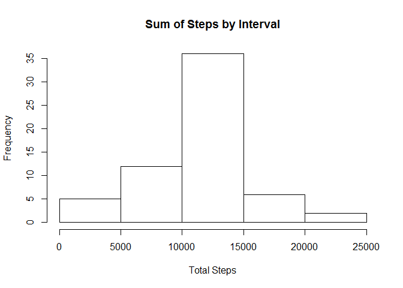
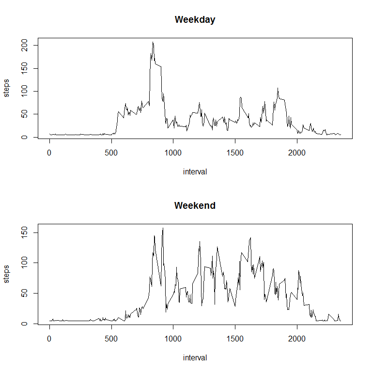

# Reproducible Research: Peer Assessment 1
Debra Moll  
October 18, 2015  


## Load the Dataset and present preliminary analysis

```r
dat <- read.csv('activity.csv', header=TRUE)
```

#### The activity contains steps taken at intervals during a day from 2012-10-01 to 2012-11-30. There are 12 intervals for each hour, at increments of 5 minutes. 

### Histogram of the total # of steps taken each day

```r
steps_sum <- aggregate(dat$steps, by=list(Category=dat$date), FUN=sum, na.rm=TRUE)
hist(steps_sum$x, xlab="Total Steps", ylab="Frequency")
```

 

### Mean and Median of the total # of steps taken each day

```r
mean(steps_sum$x)  
```

```
## [1] 9354.23
```

```r
median(steps_sum$x) 
```

```
## [1] 10395
```


## What is the average daily activity pattern?

```r
avg_by_interval <- aggregate(dat$steps, by=list(interval=dat$interval), FUN=mean, na.rm=TRUE)
plot(avg_by_interval$x ~ avg_by_interval$interval, type = "l", 
     ylab="steps", xlab="interval", main="Average Steps by Interval")  
```

 

### What is the maximum number of steps across intervals, and which interval contains the max

```r
max(avg_by_interval$x)
```

```
## [1] 206.1698
```

```r
avg_by_interval[avg_by_interval[,"x"]==max(avg_by_interval$x),][,"interval"]
```

```
## [1] 835
```


## Addressing missing data

```r
#replace na's with the average steps across the data set
dat_clean <- dat
dat_clean$steps[which(is.na(dat_clean$steps))] <- mean(dat$steps,na.rm=TRUE)

steps_sum_clean <- aggregate(dat_clean$steps, by=list(Category=dat_clean$date), FUN=sum, na.rm=TRUE)
hist(steps_sum_clean$x, xlab="Total Steps", ylab="Frequency", main="Sum of Steps by Interval")
```

 


## Are there differences in activity patterns between weekdays and weekends?


```r
options(warn=0)
library(timeDate)
```

```
## Warning: package 'timeDate' was built under R version 3.1.3
```

```r
dat_clean$weekday <- ifelse(isWeekday(dat_clean$date), 'WEEKDAY', 'WEEKEND')
dat_clean_weekday <- dat_clean[dat_clean[,"weekday"] == 'WEEKDAY', ]
dat_clean_weekend <- dat_clean[dat_clean[,"weekday"] == 'WEEKEND', ]
avg_by_interval_weekday <- aggregate(dat_clean_weekday$steps, 
                                     by=list(interval=dat_clean_weekday$interval), 
                                     FUN=mean, 
                                     na.rm=TRUE)
avg_by_interval_weekend <- aggregate(dat_clean_weekend$steps, 
                                     by=list(interval=dat_clean_weekend$interval), 
                                     FUN=mean, 
                                     na.rm=TRUE)

par(mfrow=c(2,1))
plot(x ~ interval, avg_by_interval_weekday, type = "l", ylab="steps", main="Weekday")
plot(x ~ interval, avg_by_interval_weekend, type = "l", ylab="steps", main="Weekend")
```

 

